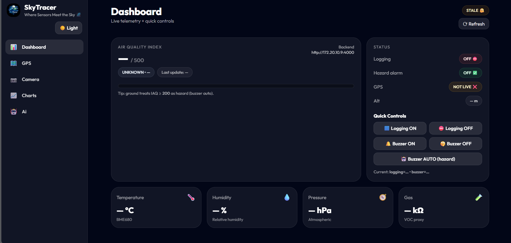
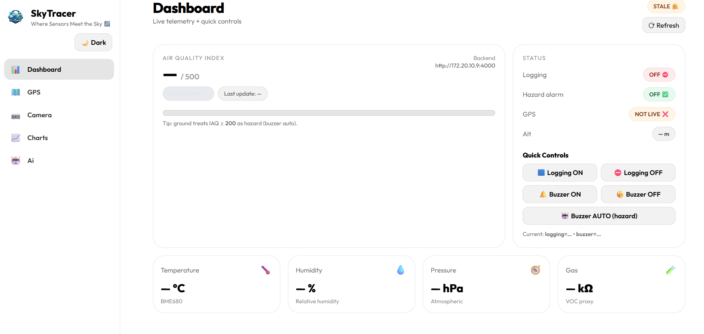
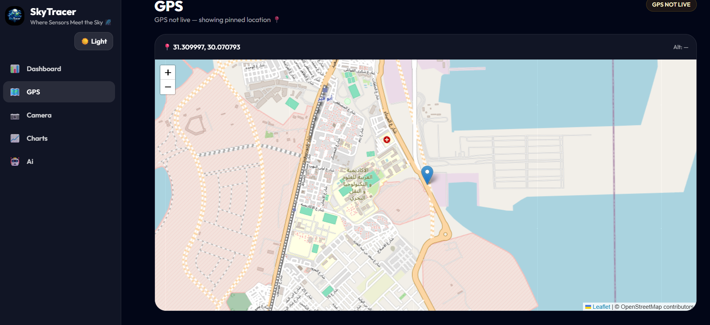

<p align="center">

</p>
<h1 align="center">
🚀 SkyTracer -- Smart Atmospheric Telemetry & AI Forecasting System
</h1>
<p align="center">
🌍 Real-Time Environmental Monitoring • 📡 LoRa Telemetry • 🧠 AI Hazard
Prediction
<br/> 🎓 Final Project -- Data Acquisition Course
</p>

------------------------------------------------------------------------

## 🧠 Overview

**SkyTracer** is a full-stack atmospheric data acquisition and
forecasting system designed as a complete end-to-end prototype.

It integrates:

-   📦 Embedded payload hardware (ESP32 + multi-sensor system)
-   📡 Long-range LoRa telemetry communication
-   🖥️ Real-time web dashboard
-   🧠 AI-based IAQ forecasting & hazard prediction
-   💾 Data logging & backend architecture

SkyTracer simulates a high-altitude atmospheric monitoring platform
capable of collecting environmental data and predicting air quality
risks in real time.

------------------------------------------------------------------------

## 🌟 Key Features

### 📦 Hardware (Payload Unit)

-   🌡️ BME680 (Temperature, Humidity, Pressure, Gas)
-   🌡️ DS18B20 (Redundant temperature validation)
-   📍 GPS module (Location + altitude)
-   🕒 DS3231 RTC (Time fallback)
-   💾 SD Card logging system
-   📡 LoRa AS32 communication
-   🔋 Autonomous payload architecture

------------------------------------------------------------------------

### 📡 Ground Station

-   Receives LoRa telemetry
-   Sends control commands (logging, buzzer mode)
-   USB bridge to backend server

------------------------------------------------------------------------

### 🌐 Web Application

-   ⚡ Real-time dashboard via Socket.IO
-   📊 Live IAQ visualization
-   📍 GPS live map (Leaflet)
-   🔔 Manual & Auto buzzer control
-   📁 Logging control system
-   🌙 Light / Dark mode UI
-   📸 Camera stream integration
-   📈 Trend analysis & telemetry display

------------------------------------------------------------------------

### 🧠 AI Module

-   IAQ Forecasting (multi-step prediction)
-   Hazard probability estimation
-   Hazard ETA estimation
-   Trend detection (RISING / FALLING / STABLE)
-   Model performance metrics (MAE & AUC)

AI is trained using logged telemetry data and deployed inside the
backend.

------------------------------------------------------------------------

## 🖥️ Web App Screenshots

### 🌙 Dark Dashboard

<p align="center">

</p>

### ☀️ Light Dashboard

<p align="center">

</p>

### 📍 GPS Page

<p align="center">

</p>

------------------------------------------------------------------------

## ⚙️ How To Run The Web Application

### 1️⃣ Backend

``` bash
cd webapp/backend
npm install
npm run dev
```

If no dev script:

``` bash
node src/server.js
```

Backend runs on:

    http://localhost:4000

------------------------------------------------------------------------

### 2️⃣ Frontend

Open a second terminal:

``` bash
cd webapp/frontend
npm install
npm run dev
```

Open:

    http://localhost:5173

------------------------------------------------------------------------

### 🧠 Train AI Model (Optional)

``` bash
cd webapp/backend
python ai/train_ai.py
```

------------------------------------------------------------------------

## 📂 Repository Structure

    SkyTracer/
    │
    ├── hardware/
    │   ├── payload/
    │   ├── ground/
    │   └── camera/
    │
    ├── webapp/
    │   ├── backend/
    │   └── frontend/
    │
    ├── demo/
    │   ├── logos/
    │   └── screenshots/
    │
    └── README.md

------------------------------------------------------------------------

## 🎓 Academic Context

This project was developed as a **Final Project for the Data Acquisition
Course**.

It demonstrates:

-   Embedded systems integration
-   Multi-sensor data acquisition
-   Real-time communication
-   Full-stack web engineering
-   AI forecasting integration
-   System-level architecture design

------------------------------------------------------------------------

## 👥 Team Members

- **[@Mohamed Abdallah Eldairouty](https://github.com/MohamedEldairouty)** – 221001719  
- **[@Rimas Emad](https://github.com/rimaseldib)** – 221001067 
- **Moaz Ali** – 221001970 
- **Judy Yehia** – 221000495

------------------------------------------------------------------------

## 🚀 Deployment Note

SkyTracer was designed as an atmospheric balloon payload prototype.\
Due to payload mass constraints, full balloon deployment was not
flight-tested.

All subsystems (sensing, telemetry, logging, AI forecasting, dashboard
control) were validated in ground testing.

------------------------------------------------------------------------

## 🛠️ Technologies Used

-   ESP32
-   LoRa AS32
-   Node.js + Express
-   MongoDB
-   Socket.IO
-   React + Vite
-   TailwindCSS
-   Chart.js
-   Leaflet
-   Python (AI Model)

------------------------------------------------------------------------

<p align="center">
🌍 SkyTracer -- Observe. Analyze. Predict.
</p>
